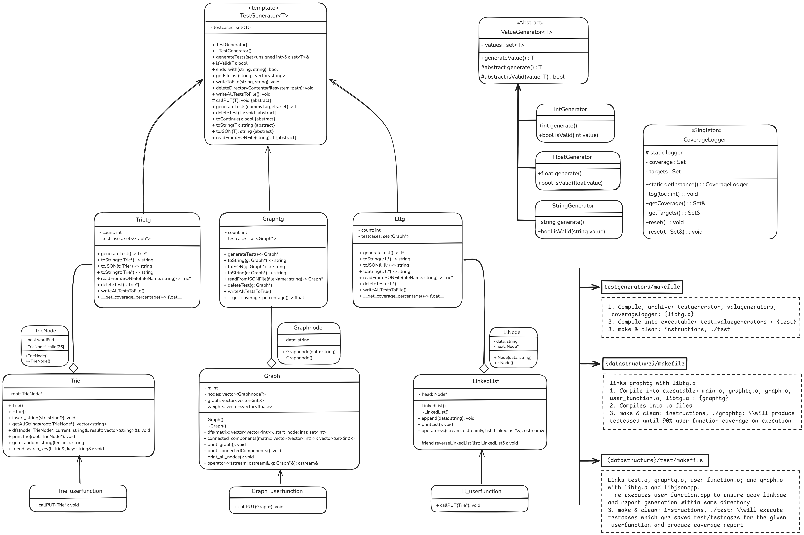

## TestX
A test generation framework which uses gcov to produce data structures that can be used to test long files of code. 
Current support includes generation framework for 3 data structures: linked-lists, graphs, trie. 

### A basic class diagram representing the framework
 

#### How to run the application: 
1. In test generators folder run: 
```bash
make
```
You will see a libtg.a library being made after running this command. 

2. Go to the datastructures directory and locate the data structure you will like to generate.<br/>
    2.1. Insert the function to be tested in user_function.cpp; it must follow the pattern of parameters already specified in the file.<br/> 
    2.2. Use makefile again: 
```bash
make
```
You will see random data structures being generated until threshold 80% line coverage is met. These data structures are auto stored within tests directory under testcases/ in json format.

3. Go to the test directory within the [data structure] directory itself and again use: 
```bash 
make
```
It will auto read the testcases previosuly generated and test the cases in your function to generate a gcov report of line and branch coverage.

